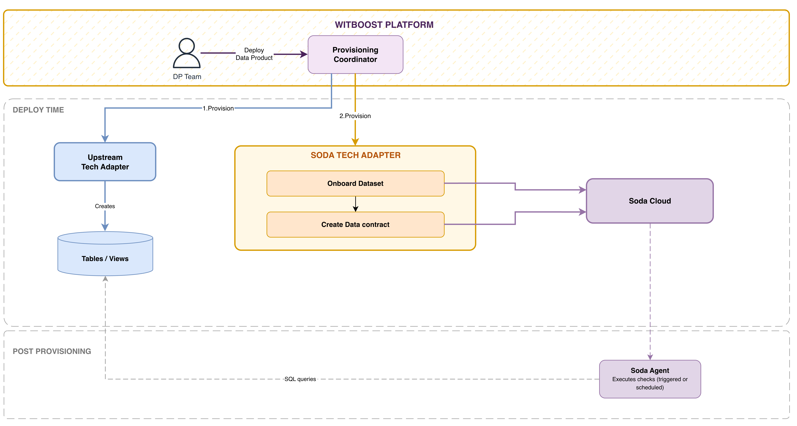

# High Level Design

This document describes the High Level Design of the Soda Tech Adapter.
The source diagrams can be found and edited in the [accompanying draw.io file](drawio-diagrams/hld.drawio).

- [Overview](#overview)
- [Provisioning](#provisioning)
  - [Provisioning Flow](#provisioning-flow)
- [Unprovisioning](#unprovisioning)
- [Validation](#validation)
- [Idempotency](#idempotency)
- [Error Handling](#error-handling)

## Overview

### Tech Adapter

A Tech Adapter is a microservice which is in charge of deploying components that use a specific technology. When the deployment of a Data Product is triggered, the platform generates it descriptor and orchestrates the deployment of every component contained in the Data Product. For every such component the platform knows which Tech Adapter is responsible for its deployment, and can thus send a provisioning request with the descriptor to it so that the Tech Adapter can perform whatever operation is required to fulfill this request and report back the outcome to the platform.

You can learn more about how the Tech Adapters fit in the broader picture [here](https://docs.witboost.com/docs/p2_arch/p1_intro/#deploy-flow).

The Soda Tech Adapter provisions **workload** components and implements the following operations:

| Operation | Endpoint | Credentials required |
| --- | --- | --- |
| **validate** | `POST /v1/validate` | None — pure descriptor check, no API calls |
| **provision** | `POST /v1/provision` → `GET /v1/provision/{token}/status` |  Soda API key (adapter configuration) |
| **unprovision** | `POST /v1/unprovision` → `GET /v1/provision/{token}/status` | Soda API key (adapter configuration) |

Provision and unprovision operations return `202 Accepted` with a token. Witboost polls `GET .../status` until the status is `COMPLETED` or `FAILED`. The Soda API key is set in adapter configuration and is never part of the component descriptor.

> **Component discrimination**: Witboost invokes this adapter for the `workload` component whose `infrastructureTemplateId` equals `urn:dmb:itm:soda-tech-adapter:0` (`componentIdToProvision` in the request points at that component's id). If it does not, the adapter fails immediately with a plain error message. A Data Product may also contain a **Guardian workload** (a Databricks job that periodically runs the Soda checks), identified by a *different* `infrastructureTemplateId` and owned and provisioned by the Databricks Tech Adapter. The Soda adapter never reads or processes that component — it only ever looks at `componentIdToProvision` and the Output Ports referenced by its `outputPortIds`.

### Soda Tech Adapter

This Tech Adapter is responsible for the automated provisioning of Soda Cloud resources as part of a Data Product provisioning workflow. It provisions **workload** components: one Soda workload per Data Product manages data quality contracts for one or more Output Ports. It is invoked by Witboost **after** the upstream Tech Adapter has successfully created the physical table/view on the target data platform. It receives metadata about the already-existing data object and configures the full Soda stack.

The Soda Tech Adapter is **technology-agnostic by design**: it operates on any data source registered in Soda Cloud, regardless of the underlying data platform. Currently, the only supported technology is **Databricks** (Unity Catalog), and the examples in this document reflect this. However, the architecture can be extended to support Output Ports backed by other technologies (e.g., Snowflake, BigQuery, PostgreSQL).

The Soda Tech Adapter communicates exclusively with the **Soda Cloud REST API** (authenticated via API key) and performs:

- Data Source resolution (the Data Source name is provided as input during Soda Workload creation)
- Output Port resolution: retrieves data contracts (with checks) and table/view metadata from the referenced Output Ports
- Discovery of newly created tables/views on the target data platform
- Dataset onboarding
- Data Contract creation, configuration, and publication

After the contract is published, the Soda Tech Adapter's responsibility ends. The runtime execution of data quality checks is entirely owned by **Soda Cloud** and **Soda Agent**.

Key architectural invariant: **the Soda Tech Adapter never communicates with the upstream data platform Tech Adapter**. Both are invoked independently by Witboost.

### Architecture Overview

The architecture involves the following components:

| Component | Responsibility |
| --- | --- |
| **Witboost Provisioning Coordinator** | Orchestrates the deployment of Data Product components, invoking Tech Adapters in sequence |
| **Upstream Data Platform Tech Adapter** | Creates tables/views on the target data platform (e.g., Databricks Unity Catalog) |
| **Soda Tech Adapter** | Provisions Soda Cloud resources: dataset onboarding, Data Contract creation and publication |
| **Soda Cloud** | Hosts datasets and Data Contracts |
| **Soda Agent** | Executes data quality checks against the target data platform (post-provisioning, out of scope) |



### Pre-requisites (Infrastructure)

| Component | Requirement |
| --- | --- |
| Soda Data Source | Pre-configured in Soda Cloud, pointing to the target data platform. The Data Source name is provided as input during Soda Workload creation |
| API credentials | API key with sufficient permissions for dataset discovery and onboarding, and contract management |
| Table/view on target platform | Already created before Soda provisioning begins (e.g., Databricks Unity Catalog table) |

### Internal Component Structure

The Soda Tech Adapter is composed of the following internal components:

```text
Soda Provisioning Service
        │
        ├── DataSource Client    → Resolves Soda Data Source by name
        ├── Discovery Client     → Triggers and monitors Soda discovery
        ├── Dataset Client       → Finds discovered dataset and triggers onboarding
        └── Contract Client      → Creates, configures, and publishes the Data Contract
```

## Provisioning

The Soda Tech Adapter receives the Data Product descriptor from Witboost. The Soda component descriptor contains the **IDs of the Output Ports** to monitor and the **Data Source name** (a pre-existing Soda Data Source specified during Soda Workload creation).

The referenced Output Ports already contain complete **data contracts** with the checks to execute and all the metadata about the underlying table/view (catalog, schema, table name, etc.). The Tech Adapter resolves these Output Ports from the Data Product descriptor and extracts:

- Table/view metadata (catalog, schema, table name, fully qualified name)
- Data contract checks (SodaCL expressions)

```yaml
# Soda component descriptor
# `databricks` is the platform key: it names which target-platform-specific parser
# the adapter uses to read dataSourceName/outputPortIds and to resolve the
# corresponding Output Port table metadata shape (see extensibility note below).
specific:
  databricks:
    dataSourceName: "databricks-production"     # must match an existing Soda Data Source
    outputPortIds:                               # references to Output Ports in the same Data Product
      - "urn:dmb:cmp:finance:orders:0:orders-output-port"
      - "urn:dmb:cmp:finance:orders:0:customers-output-port"
```

Each referenced Output Port contains the data contract definition and table metadata:

```yaml
# Example Output Port descriptor (Databricks, currently supported)
# `dataContract` follows the Open Data Contract Standard (ODCS) v3.2 shape:
# `schema` is a list of tables, each with `properties` (columns) and its own
# `quality` list. `implementation` is a raw Soda Contract Language (SodaCL)
# YAML fragment; a `column` key inside it scopes the check to that column,
# otherwise the check applies to the whole dataset. This is normalized
# internally into a flat `{check, column}` list consumed by the adapter — see
# `docs/reference-descriptor.yaml` for the full shape and
# `DataContract.normalize_odcs_v32` in `tech-adapter/src/models/data_product_descriptor.py`.
dataContract:
  schema:
    - name: orders_view
      properties:
        - name: transaction_id
          physicalType: STRING
        - name: event_date
          physicalType: DATE
      quality:
        - id: row_count_check
          type: custom
          engine: soda
          implementation: |
            row_count:
              threshold:
                must_be_greater_than: 0
specific:
  catalogName: "main"        # underlying storage table (optional, used as fallback)
  schemaName: "sales"
  tableName: "orders"
  catalogNameOP: "main"      # actual Output Port asset exposed to consumers (preferred)
  schemaNameOP: "output-port"
  viewNameOP: "orders_view"
```

> **`...OP`-suffixed fields take precedence**: the Databricks Output Port template can expose both the underlying storage table (`catalogName`/`schemaName`/`tableName`) and the actual Output Port asset built over it (`catalogNameOP`/`schemaNameOP`/`viewNameOP`, typically a view). The Tech Adapter always resolves and monitors the **`...OP` fields when present**, falling back to the base fields only when the `...OP` fields are absent. This is because Soda must discover and apply the data contract to the object consumers actually query — the internal storage table may not even be covered by the Soda Data Source's discovery scan, which can result in a `DATASET_NOT_FOUND` error if the base fields are used unconditionally. See `resolve_output_port_table_metadata()` in `tech-adapter/src/services/output_port_metadata.py`.

> **Extensibility by design**: the platform key under `specific` (`databricks` today) is the seam for supporting additional target platforms. Adding a new technology (e.g. Snowflake) means adding a new sibling key — `specific.snowflake: { dataSourceName, outputPortIds, ... }` — with its own table-metadata and fully-qualified-name conventions, without changing the `databricks` branch or breaking existing Soda workloads. The adapter selects which branch to read based on which platform key is present in `specific`. The fully qualified name pattern (`<dataSourceName>/<catalog>/<schema>/<table>`) applies to Databricks; other platforms may use different hierarchies under their own key. The per-platform key schemas and the platform-selection mechanism for additional technologies are not yet implemented.

### Provisioning Flow

The provisioning executes a sequential pipeline of phases **for each referenced Output Port**. Each phase must succeed for the next to begin. On any failure, the Tech Adapter returns a `FAILED` status to Witboost with the failing phase, Output Port ID, and cause.

| Phase | Name | Description |
| --- | --- | --- |
| 0 | Output Port Resolution | Resolve the Output Port ID from the DP descriptor; extract table metadata and data contract checks |
| 1 | Data Source Resolution | Find the pre-configured Soda Data Source by name; the Tech Adapter never creates Data Sources |
| 2 | Discovery | Trigger Soda discovery to make the table/view visible in Soda Cloud; poll until completed |
| 3 | Dataset Identification | Search for the discovered dataset by fully qualified name to avoid ambiguity |
| 4 | Dataset Onboarding | Onboard the discovered dataset into Soda Cloud; poll until completed |
| 5 | Contract Creation | Create a new Soda Data Contract associated with the onboarded dataset |
| 6 | Contract Publication | Build the Contract Language YAML from the checks and publish it; a 200 response confirms success |

The provisioning is considered **successful only when all Soda Data Contracts (one per Output Port) are verified as published**. SUCCESS does NOT mean that Soda checks pass.

On success, the Tech Adapter returns `provisionInfo` containing, for each Output Port:

- **Output Port ID** — the Witboost component ID
- **Soda Data Contract ID** — the contract ID on Soda Cloud
- **Soda Dataset ID** — the dataset ID on Soda Cloud

These IDs enable other components (e.g., a Guardian workload) to reference the Soda resources created during provisioning.

For detailed API interactions, polling behavior, and error codes for each phase, see the [Technical Details](technical-details.md).

## Unprovisioning

Unprovisioning removes the Soda contract and associated configuration for a given component. The operation is idempotent and does not fail if the resources it tries to remove are missing.

The main operations are:

- Locate the existing Data Contract for the target dataset
- Remove the Data Contract

The Soda Data Source is **never deleted** during unprovisioning, as it is pre-provisioned infrastructure shared across components.

## Validation

The `validate` operation checks the descriptor before any API call is made. Validation includes:

| Check | Detail |
| --- | --- |
| Required fields | Data Source name and at least one Output Port ID must be present |
| Data Source name | Must be a non-empty string |
| Output Port IDs | Each ID must reference an existing Output Port in the Data Product descriptor |
| Output Port metadata | Each referenced Output Port must contain valid table metadata (catalog, schema, table) |
| Contract definition | Data contract checks must be valid SodaCL expressions |

## Idempotency

The Soda Tech Adapter is designed so that each provisioning phase handles the case where the target state already exists. This ensures that if the same component is deployed again (e.g., after a code change or a new deployment), the flow completes without errors or duplications.

| Phase | Strategy |
| --- | --- |
| Data Source resolution | Naturally idempotent (read-only GET) |
| Discovery trigger | Triggered unconditionally on every run; Soda Cloud handles re-discovery of an already-discovered table as a no-op or re-scan |
| Dataset search | Naturally idempotent (read-only GET) |
| Dataset onboarding | Triggered unconditionally on every run; relies on Soda Cloud to handle re-onboarding of an already-onboarded dataset idempotently |
| Contract creation | The adapter looks up an existing contract for the dataset first and reuses its id if found, instead of creating a new one |
| Contract publication | Publishing new contents to an existing contract overwrites its checks; publishing the same contents again is a no-op from the adapter's perspective |

## Error Handling

The Tech Adapter classifies errors into the following categories:

| Category | Examples | Behavior |
| --- | --- | --- |
| **Configuration error** | Missing data source name, invalid Output Port ID | FAILED at validation, before any API call |
| **Infrastructure error** | Soda API unreachable, authentication failure | FAILED with diagnostic detail |
| **Business logic error** | Data Source not found, dataset ambiguous | FAILED with diagnostic detail |
| **Async operation failure** | Discovery failed, onboarding timeout | FAILED with phase and cause |
| **Rate limiting** | HTTP 429 from Soda Cloud API during polling | Adapter waits (using `Retry-After` or backoff) and retries; if the operation's polling timeout is reached first, it FAILS with a polling-timeout code |

The Tech Adapter returns responses conforming to the [Witboost Tech Adapter API](https://docs.witboost.com/docs/apis/extension-points/control-plane/builder/tech-adapter-api) `ProvisioningStatus` schema (`COMPLETED`, `FAILED`, or `RUNNING`).

For the full list of error codes, polling strategy, and timeout configuration, see the [Technical Details](technical-details.md).
