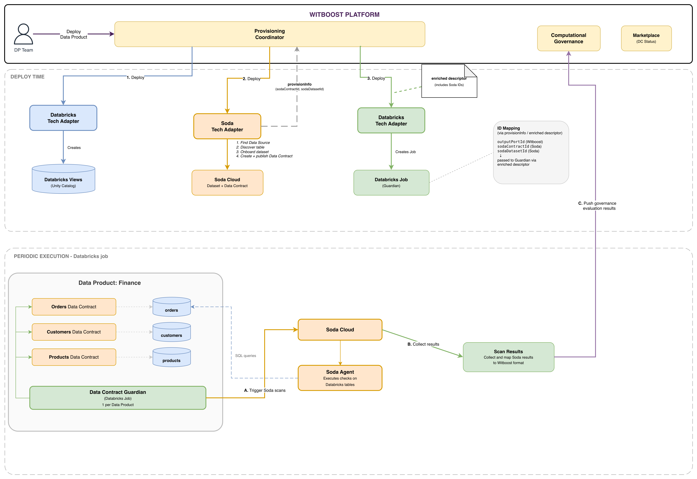

# End-to-End Example — Databricks with Soda Data Quality

This document walks through the complete provisioning flow of a Data Product on Databricks with Soda data quality contracts. It describes the end-to-end journey from deployment to periodic execution, based on the architecture shown in the diagram below.

For the generic Soda Tech Adapter design, see the [High Level Design](HLD.md). For API-level details, see the [Technical Details](technical-details.md).



---

## Architecture Components

| Component | Description |
|---|---|
| **Witboost Platform** | Provisioning Coordinator, Computational Governance, Marketplace |
| **Databricks Tech Adapter** (step 1) | Creates views on Databricks Unity Catalog |
| **Soda Tech Adapter** (step 2) | Provisions Soda Cloud resources: dataset onboarding, Data Contract creation |
| **Databricks Tech Adapter** (step 3) | Creates the Guardian Databricks Job for periodic DQ execution |
| **Soda Cloud** | Hosts datasets and Data Contracts |
| **Data Contract Guardian** | Databricks Job (1 per Data Product) that periodically executes Soda scans and pushes results to Witboost |

---

## Deploy Time

The Witboost Provisioning Coordinator invokes three Tech Adapters in sequence:

### Step 1 — Databricks Tech Adapter: Create Tables/Views

The Databricks Tech Adapter provisions the physical resources on Databricks Unity Catalog (tables, views, catalog, schema). This is a prerequisite for the Soda Tech Adapter.

### Step 2 — Soda Tech Adapter: Create Soda Data Contracts

The Soda Tech Adapter is invoked with a descriptor containing `specific.databricks.dataSourceName` and `specific.databricks.outputPortIds`. For each Output Port, it:

1. Resolves the Output Port from the DP descriptor (table metadata + data contract checks)
2. Finds the pre-configured Soda Data Source by name
3. Triggers Soda discovery to make the Databricks table visible
4. Identifies the dataset by fully qualified name (`<dataSourceName>/<catalog>/<schema>/<table>`)
5. Onboards the dataset into Soda Cloud
6. Creates, configures, and publishes the Data Contract

On success, the Tech Adapter returns `provisionInfo` containing, for each Output Port:

```json
{
  "status": "COMPLETED",
  "info": {
    "publicInfo": {
      "sodaProvisioningResult": [
        {
          "outputPortId": "urn:dmb:cmp:finance:orders:0:orders-output-port",
          "sodaContractId": "contract-abc-123",
          "sodaDatasetId": "dataset-xyz-789"
        },
        {
          "outputPortId": "urn:dmb:cmp:finance:orders:0:customers-output-port",
          "sodaContractId": "contract-def-456",
          "sodaDatasetId": "dataset-uvw-012"
        }
      ]
    }
  }
}
```

### Step 3 — Databricks Tech Adapter: Create Guardian Job

The Databricks Tech Adapter provisions a Databricks Job (the **Data Contract Guardian**), one per Data Product. This job is configured to periodically execute Soda scans against the Data Contracts created in Step 2.

The Guardian Job receives the Soda IDs (`sodaContractId`, `sodaDatasetId`) from the Soda Tech Adapter's `provisionInfo` via the enriched descriptor. 

---

## Periodic Execution

After deployment, the Data Contract Guardian executes periodically as a Databricks Job.

### A. Execute Soda Scans

The Guardian iterates over all Data Contracts in the Data Product and triggers Soda to execute checks against the corresponding Databricks tables. Each Data Contract is linked to a specific Databricks table via its `sodaDatasetId`.

### B. Collect Results

Soda executes the scans and returns results. The Guardian collects and maps the Soda results to the Witboost evaluation result format.

### C. Push Governance Evaluation Results

The Guardian pushes the evaluation results to Witboost's **Computational Governance** module, which updates the Data Contract status visible in the Marketplace.

---

## Data Product Example

The diagram shows a concrete example with the **Finance** Data Product containing three Output Ports, each backed by a Databricks table and a Soda Data Contract:

| Output Port | Databricks Table | Soda Data Contract |
|---|---|---|
| Orders | `orders` | Orders Data Contract |
| Customers | `customers` | Customers Data Contract |
| Products | `products` | Products Data Contract |

The Guardian Job processes all three contracts in a single periodic execution, running Soda scans and pushing results to Witboost.
